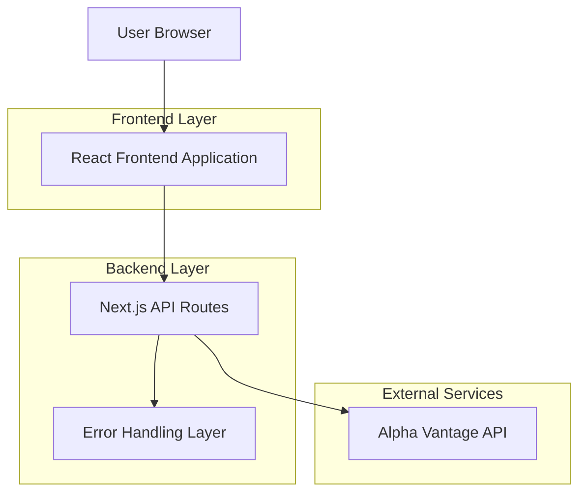
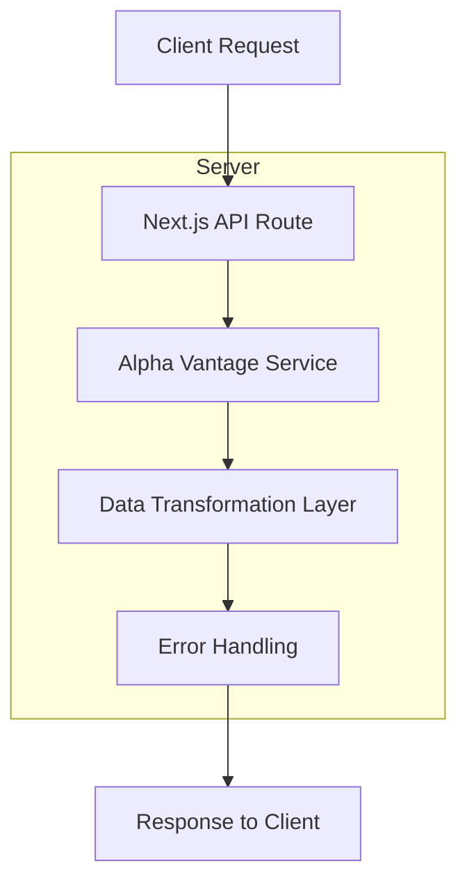
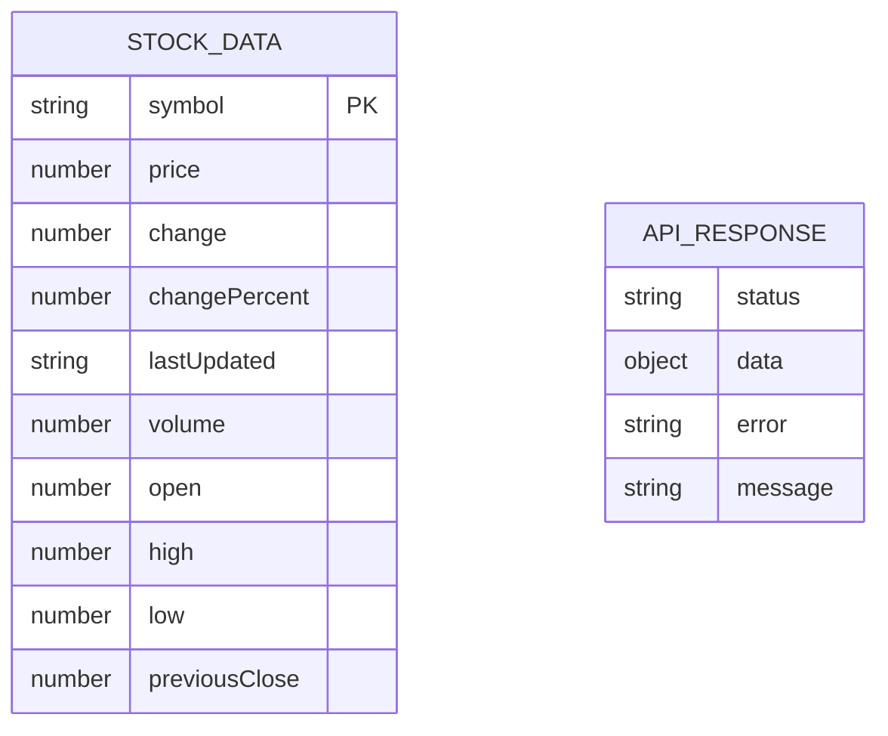

## 1. Architecture design



## 2. Technology Description
- Frontend: React@18 + Next.js@15 + TypeScript + Tailwind CSS
- Backend: Next.js API Routes
- External API: Alpha Vantage Stock API
- State Management: React hooks (useState, useEffect)

## 3. Route definitions

| Route | Purpose |
|-------|---------|
| / | Stock dashboard page, displays Spirit Airlines real-time price |
| /details | Detailed stock information page with historical data |
| /api/stock/[symbol] | API endpoint to fetch stock data from Alpha Vantage |

## 4. API definitions

### 4.1 Core API

Stock data retrieval
```
GET /api/stock/SAVE
```

Response:
| Param Name | Param Type | Description |
|------------|------------|-------------|
| symbol | string | Stock symbol (SAVE) |
| price | number | Current stock price |
| change | number | Price change amount |
| changePercent | number | Price change percentage |
| lastUpdated | string | ISO timestamp of last update |
| volume | number | Trading volume |
| open | number | Opening price |
| high | number | Day's high price |
| low | number | Day's low price |
| previousClose | number | Previous day's closing price |

Example Response:
```json
{
  "symbol": "SAVE",
  "price": 8.45,
  "change": -0.23,
  "changePercent": -2.65,
  "lastUpdated": "2024-01-15T16:00:00Z",
  "volume": 1250000,
  "open": 8.70,
  "high": 8.75,
  "low": 8.40,
  "previousClose": 8.68
}
```

Error Response:
```json
{
  "error": "API_LIMIT_EXCEEDED",
  "message": "Alpha Vantage API rate limit exceeded. Please try again later."
}
```

## 5. Server architecture diagram



## 6. Data model

### 6.1 Data model definition



### 6.2 TypeScript Interfaces

```typescript
// Stock data interface
interface StockData {
  symbol: string;
  price: number;
  change: number;
  changePercent: number;
  lastUpdated: string;
  volume: number;
  open: number;
  high: number;
  low: number;
  previousClose: number;
}

// API response interface
interface ApiResponse<T> {
  success: boolean;
  data?: T;
  error?: string;
  message?: string;
}

// Alpha Vantage API response (raw)
interface AlphaVantageResponse {
  'Global Quote': {
    '01. symbol': string;
    '05. price': string;
    '09. change': string;
    '10. change percent': string;
    '07. latest trading day': string;
    '06. volume': string;
    '02. open': string;
    '03. high': string;
    '04. low': string;
    '08. previous close': string;
  };
}
```

### 6.3 Environment Variables

```bash
# Required environment variables
ALPHA_VANTAGE_API_KEY=your_api_key_here
NEXT_PUBLIC_APP_NAME=Stock Price Tracker
```

### 6.4 API Integration Notes

- Alpha Vantage free tier allows 5 API requests per minute and 500 requests per day
- Use GLOBAL_QUOTE function for real-time data
- Implement proper error handling for rate limits and API failures
- Cache responses for 30 seconds to minimize API calls
- API Key should be stored securely in environment variables