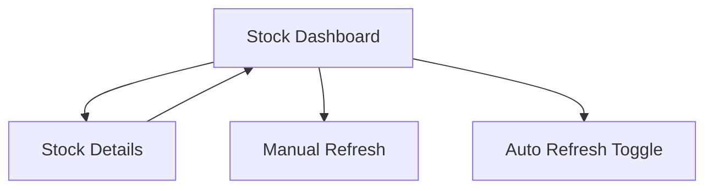

## 1. Product Overview
A real-time stock price tracker for Spirit Airlines (SAVE) that fetches and displays current market data using the Alpha Vantage API.
- Provides investors and users with up-to-date stock information for Spirit Airlines to make informed decisions.
- Target market includes retail investors, financial enthusiasts, and anyone tracking airline industry performance.

## 2. Core Features

### 2.1 User Roles
No user authentication required - public access to stock data.

### 2.2 Feature Module
Our stock price tracker consists of the following main pages:
1. **Stock Dashboard**: real-time price display, price change indicators, refresh functionality.
2. **Stock Details**: detailed stock information, historical data view, market statistics.

### 2.3 Page Details

| Page Name | Module Name | Feature description |
|-----------|-------------|---------------------|
| Stock Dashboard | Price Display | Show current SAVE stock price, percentage change, and last updated timestamp |
| Stock Dashboard | Refresh Control | Manual refresh button and auto-refresh toggle with 30-second intervals |
| Stock Dashboard | Status Indicator | Display API connection status and loading states |
| Stock Details | Market Data | Show open, high, low, close prices and trading volume |
| Stock Details | Price History | Display price changes over different time periods (1D, 1W, 1M) |
| Stock Details | Error Handling | Show user-friendly error messages for API failures or network issues |

## 3. Core Process
User visits the stock dashboard to view current Spirit Airlines stock price. The application automatically fetches data from Alpha Vantage API and displays real-time information. Users can manually refresh data or enable auto-refresh mode. If users want more details, they can navigate to the detailed view for comprehensive market data.

## 4. User Interface Design

### 4.1 Design Style
- Primary colors: Blue (#2563eb) for positive changes, Red (#dc2626) for negative changes
- Secondary colors: Gray (#6b7280) for neutral text, Green (#16a34a) for success states
- Button style: Rounded corners with subtle shadows
- Font: Inter or system default, sizes 14px-32px for different hierarchy levels
- Layout style: Clean card-based design with centered content
- Icons: Financial and arrow icons for price movements, refresh icons for controls

### 4.2 Page Design Overview

| Page Name | Module Name | UI Elements |
|-----------|-------------|-------------|
| Stock Dashboard | Price Display | Large price text (32px), percentage badge with color coding, timestamp in gray |
| Stock Dashboard | Refresh Control | Primary blue button, toggle switch with labels, loading spinner |
| Stock Details | Market Data | Grid layout with labeled values, consistent spacing, subtle borders |
| Stock Details | Price History | Simple line chart or percentage indicators, time period tabs |

### 4.3 Responsiveness
Mobile-first responsive design with touch-optimized buttons and readable text sizes on all devices.
